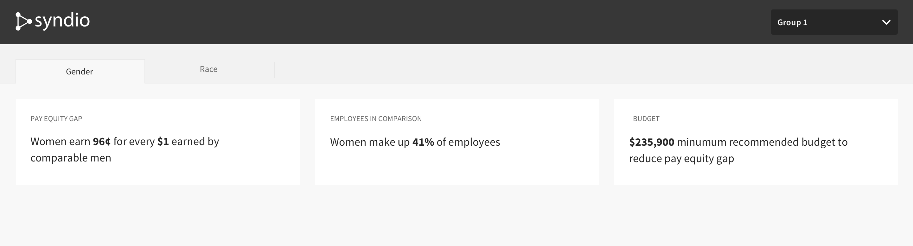
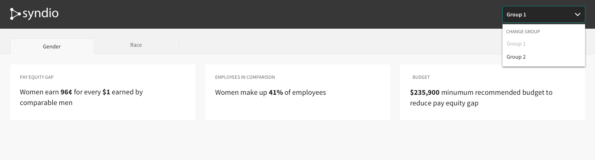
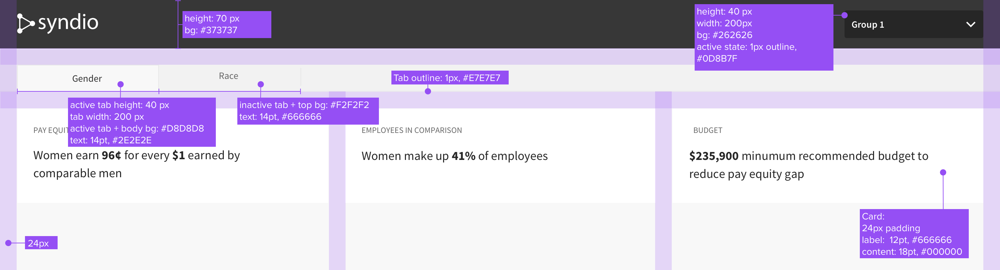

## Overview

For this QA technical take-home challenge, you will QA a simple Syndio dashboard. (Note that the dashboard has intentional issues.) This is not a timed exercise, and we do not expect it to take much of your time.

### Instructions to run the dashboard

To run locally you must first install Node. For the required version see package.json. After installing Node and cloning this repo the following commands will get you up and running.

1. `npm install` (install the requirements)
2. `npm start` (start the application locally)

### Requirements

Use an automated UI test framework that tests the Dashboard. The original specs for the Dashboard are in the next section.

*   Using Javascript or Python open source tool of your choosing, please write automated end-to-end tests for this feature. These should be the tests you consider most critical for testing this feature.
*   Write manual test cases for anything that won’t be caught by the automation.
*   Document any bugs you find.
*   Please package your submission as you would package any code that you'd like to hand off to another developer — runnable and testable. Also please share a screencast of your e2e test.
*   Remember to include a README that tells us how to run your code!

### Submission:

*   Upload your completed project to your GitHub, and then email your main Syndio contact a link to the repository. Alternatively, you can email back the zip file without node modules.

## Original Syndio dashboard Project Specs

See the mocks on the next section for design guidelines and read these instructions:

*   Make GET requests to get all the data you need to build the dashboard.

    *   Get `Group Names & IDs` (for header dropdown): [https://run.mocky.io/v3/9e343425-c47c-4c7f-a1ac-972c099be0ed](https://run.mocky.io/v3/9e343425-c47c-4c7f-a1ac-972c099be0ed)

    *   Get `Group by Function` (for page content): [https://run.mocky.io/v3/a9f6a4b7-d03c-4a45-b64b-791e054f36b8](https://run.mocky.io/v3/a9f6a4b7-d03c-4a45-b64b-791e054f36b8)

        _(They are basic apis with mock data, so please don’t worry about the mismatched group ID between this api and the previous api.)_

    *   Get `Group by Role` (for page content): [https://run.mocky.io/v3/f1b01b57-3147-476a-a632-0c10ad2a3c1a](https://run.mocky.io/v3/f1b01b57-3147-476a-a632-0c10ad2a3c1a)

*   Include the ability to toggle between the `Gender` and `Race` tabs.
*   Your page should be responsive, with a small, a mid and a large breakpoint.
*   Add `group` query param into page url, e.g.:  [https://localhost:3000/?group=a9f6a4b7-d03c-4a45-b64b-791e054f36b8](http://localhost:3000/?group=2) will render `Group by Function` data

## Mocks

Numbers need to match what’s returned from the mock apis.

With dropdown open

Style specs

